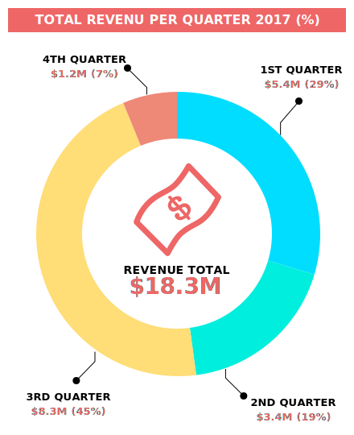
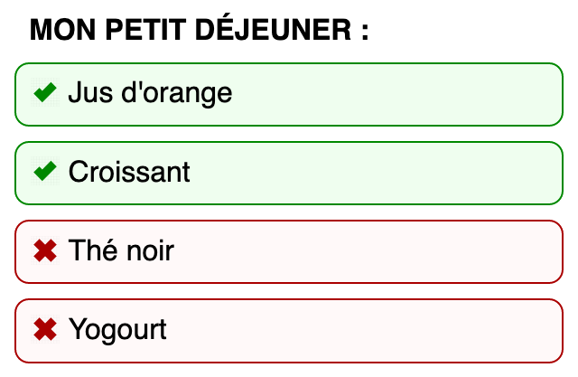
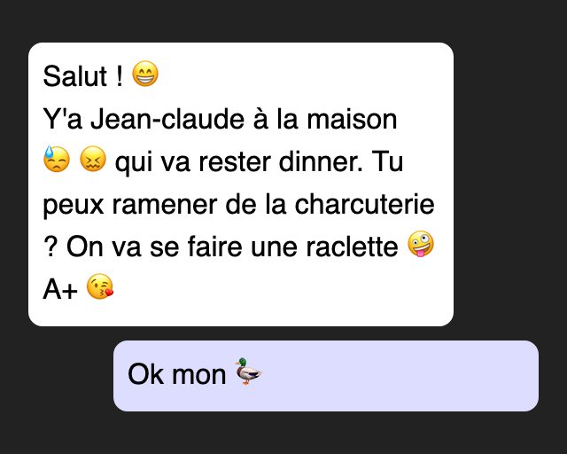

# SVG Accessible !

 <!-- .element: style="height: 1.5em; vertical-align: middle; background: none; border: none;" -->
[@JeremiePat](https://twitter.com/JeremiePat) / [JeremiePat.github.io/svg-accessible](https://JeremiePat.github.io/svg-accessible)

---

<!-- .slide: data-background-image="img/bg/two-headed-monster.png" -->
## image/svg+xml

---

<!-- .slide: data-background-image="img/bg/accessible.jpg" -->
## C'est quoi une image accessible ?

<!-- .slide: data-background-image="img/bg/murmur.jpg" -->
<!-- .element: class="dark" -->
## Ornementation / Information

---

## SVG : un format d'image

- CSS : <!-- .element: class="fragment" -->
  - `background-image`
  - `border-image-source`
  - `content`
  - `cursor`
  - `list-style-image`
  - `mask-image`
  - `symbols`
- HTML : <!-- .element: class="fragment" -->
  - ``
  - `<picture>`
- SVG : <!-- .element: class="fragment" -->
  - `<image>`

<!-- .slide: data-background-image="img/bg/code.jpg" -->
<!-- .element: class="code" -->
<pre style="font-size:0.8em"><code class="hljs" data-trim data-line-numbers="2,3,6,11">
&lt;img src="…"
  alt=""
  title=""&gt;

&lt;picture
  title=""&gt;

  &lt;source src="…" media="…"&gt;

  &lt;img src="…"
    alt=""&gt;
&lt;picture&gt;
</code></pre>

Note:
- Bonne pratique picture: title et aria-label devraient avoir la même valeur, l'img devrais être invisible au niveau accessibilité
- Safari ne reconnais pas aria-label sur picture
- Bonne pratique img: alt et aria-label devraient avoir la même valeur

---

## SVG : un format de document

- HTML: <!-- .element: class="fragment" -->
  - `<svg>`
  - `<iframe>`
  - `<object>`

<!-- .slide: data-background-image="img/bg/text.jpg" -->
<!-- .element: class="darker" -->
## Image + Text

- `<text>`
- `<tspan>`

## A11Y à la sauce SVG

- Attributs : <!-- .element: class="fragment" -->
  - `lang` et `xml:lang`
  - `tabindex`
- Balises : <!-- .element: class="fragment" -->
  - `<title>`
  - `<desc>`
  - `<metadata>` 🤔

<!-- .slide: data-background-image="img/bg/code.jpg" -->
<!-- .element: class="code" -->
<pre><code class="html hljs" data-trim data-line-numbers="2-7,10,13-17">
&lt;svg viewBox="0,0,10,12"
  lang="en" xml:lang="en"&gt;
  &lt;title&gt;A square looking like a circle&lt;/title&gt;

  &lt;desc&gt; This image show how it is possible to use a square shape and
    having it looking like a circle by using the rx and ry attributes of
    the rect element.&lt;/desc&gt;

  &lt;rect width="10" height="10" rx="5" ry="5"&gt;
    &lt;title&gt;It looks like a circle but it's a square&lt;/title&gt;
  &lt;/rect&gt;

  &lt;a tabindex="0" xlink:href="https://www.youtube.com/watch?v=CMP9a2J4Bqw"&gt;
    &lt;text x="5" y="11.5" text-anchor="middle" font-size="1.5"&gt;
      Squaring The Circle
    &lt;/text&gt;
  &lt;/a&gt;
&lt;/svg&gt;
</code></pre>

---

## SVG + ARIA

<!-- .element: class="dark" -->
<!-- .slide: data-background-image="img/bg/theorie.jpg" -->
## De belles spécifications

[ARIA 1.1](https://www.w3.org/TR/wai-aria/) + [ARIA Graphics 1.0](https://www.w3.org/TR/graphics-aria-1.0/)  + [SVG 2](https://www.w3.org/TR/SVG2/struct.html#WAIARIAAttributes) + [SVG-AAM 1.0](https://www.w3.org/TR/svg-aam-1.0/) = ❤️

Note:
Remerciement à Amelia Bellamy-Royds et Ian Pouncey

## Et sinon, dans la vraie vie veritable…
<!-- .slide: data-background-image="img/bg/pratique.jpg" -->

## Une petite touch d'ARIA

- `aria-label`
- `aria-labelledby`
- `aria-describedby`
- ~~`aria-details`~~

Note:
- `svg[role=img]`
- `a[role=link]`

<!-- .slide: data-background-image="img/bg/code.jpg" -->
## Level 🤪: HTML

<pre contenteditable spellcheck="false"><code class="hljs html" data-trim data-line-numbers="5,6,9">
&lt;article lang="en"&gt;
  &lt;h1&gt;2017 Incomes&lt;/h1&gt;

  &lt;img src="charts.svg"
    alt="2017 Incomes Chart"
    aria-describedby="desc"
  /&gt;

  &lt;p id="desc"&gt;
    This chart represent the incomes for the year 2017,
    both in absolute value and percentage of the total
    incomes. The total incomes are $18.3 millions and
    they are split as follow: $5.4 millions for the
    first quarter (29%), $3.4 millions for the second
    quarter (19%), $8.3 millions for the third quarter
    (45%),$1.2 millions for the fourth quarter (7%).
  &lt;/p&gt;
&lt;/article&gt;
</code></pre>

<!-- .slide: data-background-image="img/bg/code.jpg" -->
## Level 🤔: SVG

<pre><code class="hljs html" data-trim data-line-numbers="3,4,5,7,9">
&lt;svg viewBox="0 0 440 540"
  xmlns="http://www.w3.org/2000/svg"
  lang="en" xml:lang="en"
  aria-labelledby="title"
  aria-discribedby="description"&gt;

  &lt;title id="title"&gt;2017 Incomes Chart&lt;/title&gt;

  &lt;desc id="description"&gt;
    This chart represent the incomes for the year 2017,
    both in absolute value and percentage of the total
    incomes. The total incomes are $18.3 millions and
    they are split as follow: $5.4 millions for the
    first quarter (29%), $3.4 millions for the second
    quarter (19%), $8.3 millions for the third quarter
    (45%),$1.2 millions for the fourth quarter (7%).
  &lt;/desc&gt;

  ...
&lt;/svg&gt;
</code></pre>

<!-- .element: class="darker" -->
<!-- .slide: data-background-image="img/bg/map.jpg" -->
## Level 🐲: SVG

<iframe src="img/charts.svg" style="width:570px; height:700px; background: white"></iframe>

<!-- .slide: data-background-image="img/bg/code.jpg" -->
## Level 🐲: SVG

<pre><code class="hljs html" data-trim data-line-numbers="3,4,5,7,11-13">
&lt;svg viewBox="0 0 440 540"
  xmlns="http://www.w3.org/2000/svg"
  lang="en" xml:lang="en"
  aria-labelledby="title"
  aria-discribedby="description"&gt;

  &lt;desc id="description"&gt; ... &lt;/desc&gt;

  &lt;g&gt;
    &lt;rect x="10" y="10" width="420" height="30"&gt;&lt;/rect&gt;
    &lt;text id="title" x="220" y="30"&gt;
      TOTAL REVENU PER QUARTER 2017 (%)
    &lt;/text&gt;
  &lt;/g&gt;

  ...
&lt;/svg&gt;
</code></pre>

<!-- .slide: data-background-image="img/bg/code.jpg" -->
## Level 🐲: SVG

<pre><code class="hljs html" data-trim data-line-numbers="1,2,8,14-19">
  &lt;g tabindex="0" arial-labelledby="Q1TXT"&gt;
    &lt;text aria-hidden="true"&gt;
      &lt;tspan x="375" y="91"&gt;1ST QUARTER&lt;/tspan&gt;
      &lt;tspan x="375" y="109"&gt;$5.4M (29%)&lt;/tspan&gt;
    &lt;/text&gt;

    &lt;use id="Q1" xlink:href="#Q1SHAPE"&gt;
      &lt;title id="Q1TXT"&gt;First Quarter: $5.4M (29%)&lt;/title&gt;
    &lt;/use&gt;
  &lt;/g&gt;

  ...

  &lt;g tabindex="0"&gt;
    &lt;text&gt;
      &lt;tspan x="220" y="340"&gt;REVENUE TOTAL&lt;/tspan&gt;
      &lt;tspan x="218" y="365" &gt;$18.3M&lt;/tspan&gt;
    &lt;/text&gt;
  &lt;/g&gt;
</code></pre>

<!-- .element: class="darker" -->
<!-- .slide: data-background-image="img/bg/map.jpg" -->
## Level 🐲: SVG

<iframe src="img/charts.svg" style="width:570px; height:700px; background: white"></iframe>

---

<!-- .element: class="dark" -->
<!-- .slide: data-background-image="img/bg/sparkle.jpg" -->
## Ok, et maintenant ?

Tester, tester et encore tester… 
et éventuellement tester encore une fois, au cas où !
<!-- .element: class="fragment" -->

Note: C'est en forgeant qu'on devient forgeron

<!-- .slide: data-background-image="img/bg/rising-sun.jpg" -->
## Quelques lueurs d'espoire

- <!-- .element: class="fragment" --> <a href="https://a11yproject.com">A11Y Project</a>
- <!-- .element: class="fragment" --> <a href="https://www.powermapper.com/tests/screen-readers/">PowerMapper — Screen Reader Reliability</a>
- <!-- .element: class="fragment" --> <a href="https://webaim.org/techniques/screenreader/">WebAIM — Designing for Screen Reader Compatibility</a>

<!-- .slide: data-background-image="img/bg/rising-sun.jpg" -->
# Merci
## 🤯😘❤️🌈🦄
